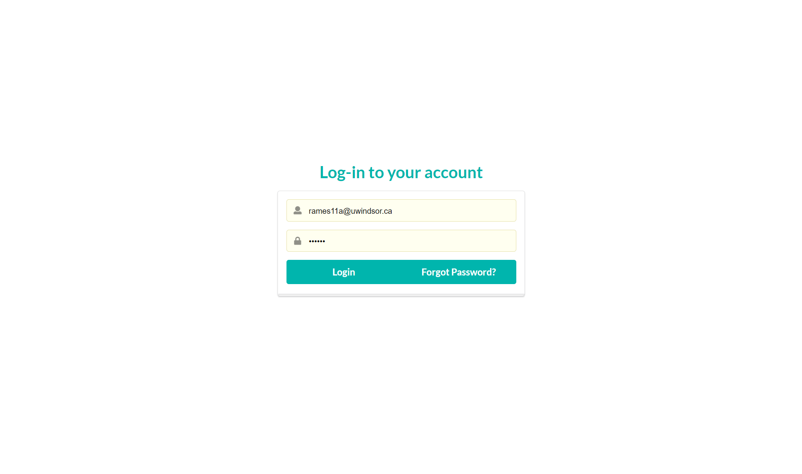
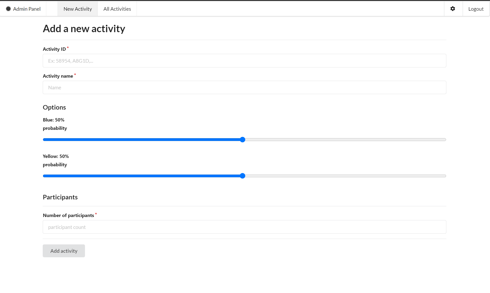
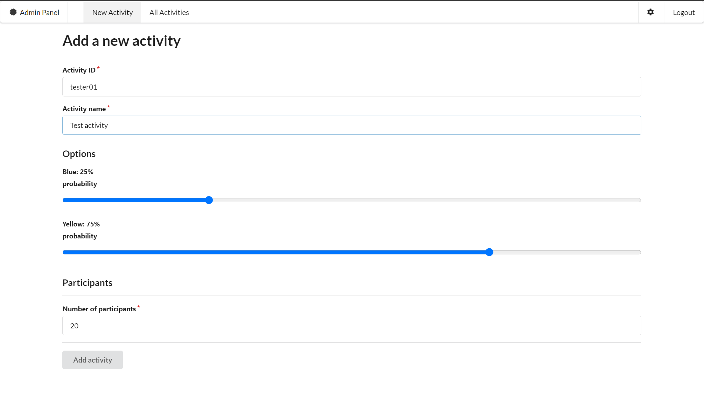
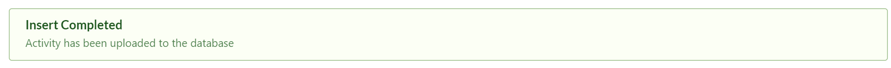
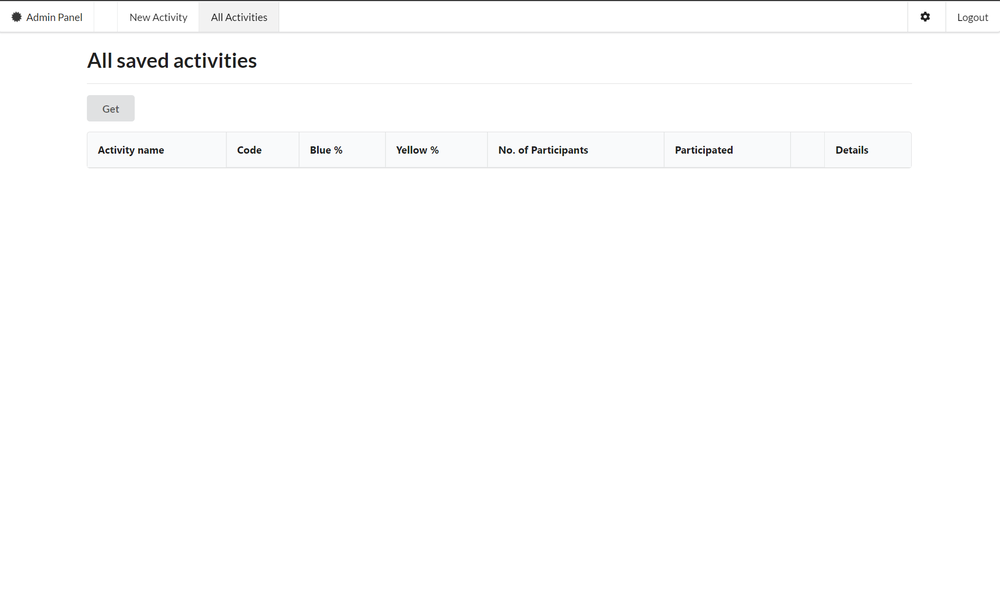
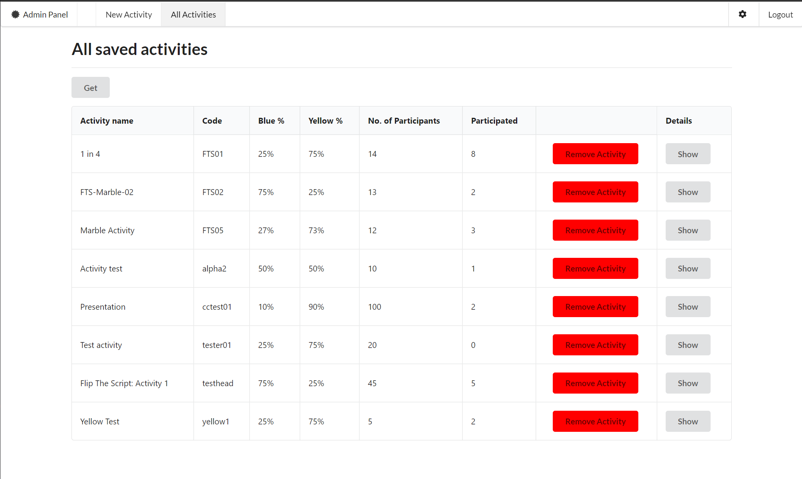
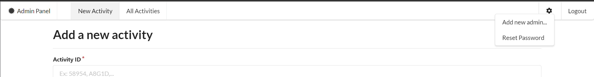
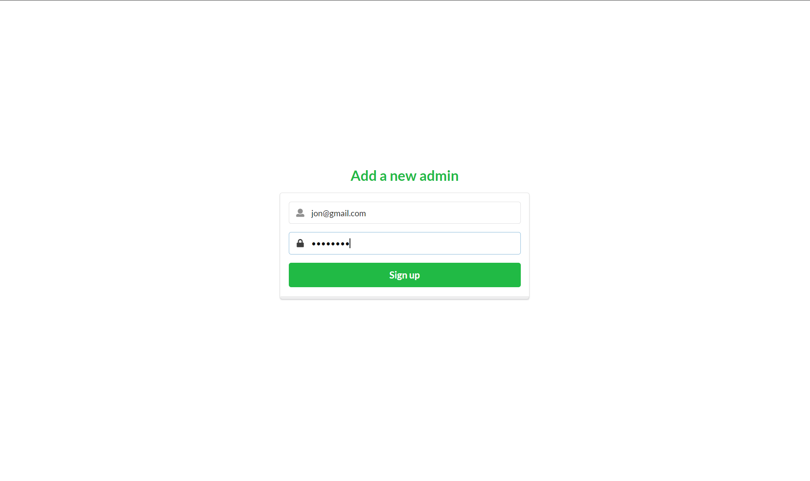

# Marble Activity (Flip the Script)

## Testing changes to code
Save any changes made. Then open command prompt, navigate to the folder with the source code and run:
```bash 
npm start
```

## Deploying to firebase

### Project name
`` flip-the-script``

### Steps
Login to Firebase by running this command: 
```bash
firebase login
```
You will be redirected to a login window, where you'll need to login using the gmail account which has access to this project. 

Once you are logged in, run this command:
```bash
firebase deploy
```
### Useful links

Deploying to firebase: https://www.robinwieruch.de/firebase-deploy-react-js

ReactJs: https://reactjs.org/

Create-react-app: https://create-react-app.dev/

Firebase console: https://console.firebase.google.com/

### Language used

ReactJS. This application was created using ``` create-react-app ```

## Logging in

### Step 1
Go to https://flip-the-script.web.app/admin and log in using your credentials



Once you login, you'll be redirected to the "New Activity" page, where you can make a new activity



### Step 2

Fill in the form and click on the "Add activity" button



If it is successful, you will see a green message box appear at the bottom of the page like so:



## Managing activities

### Step 1
Navigate to "All activities" using the top nav bar



Click on the "Get" button to load all saved activities



## Adding a new admin

### Step 1 
Click on the gear icon and select the "add new admin..." option from the dropdown




### Step 2
You will then be redirected to a page where you can enter the new email address and new password of the admin account you want to create



Once you click on "Sign up", an email will be sent to the new account, letting them know the account has been successfully created.
